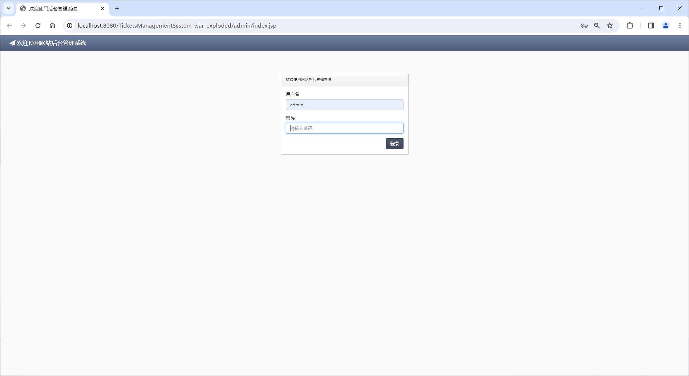
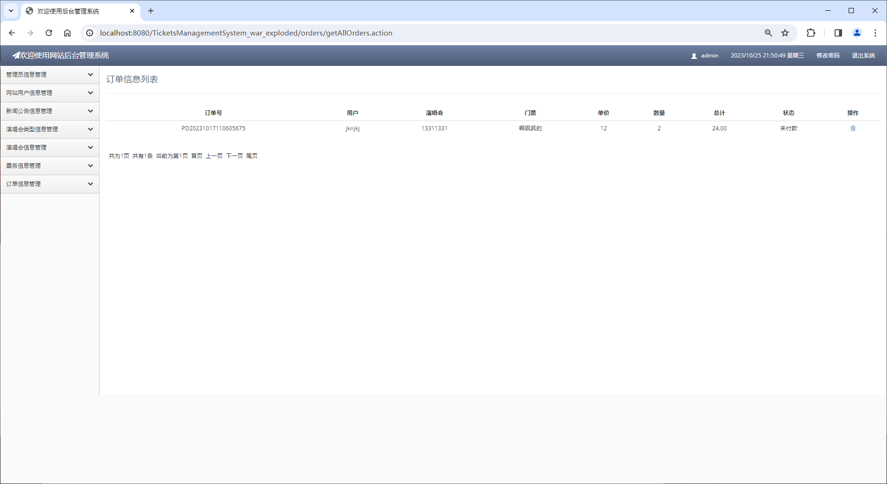
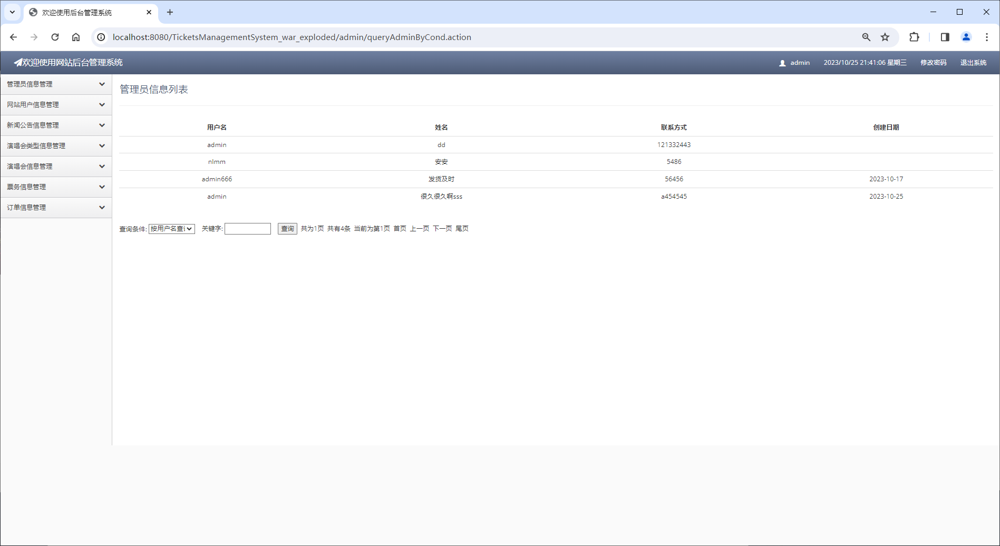
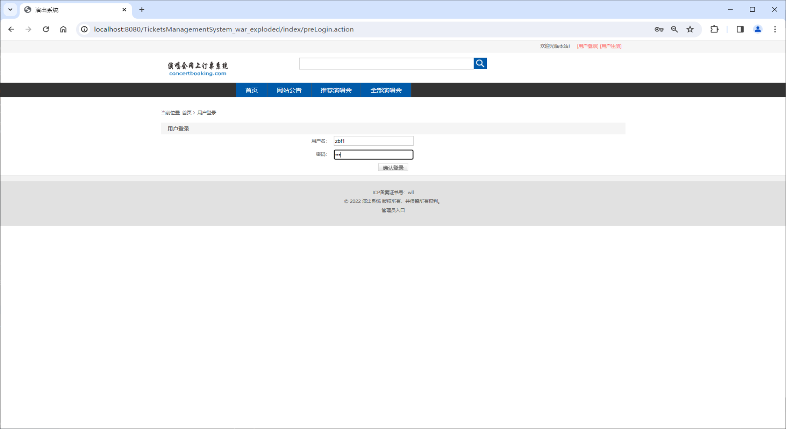
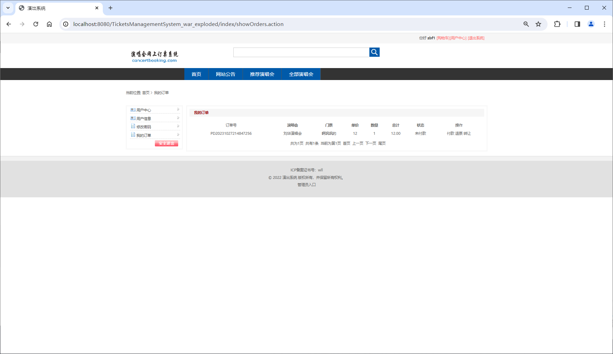
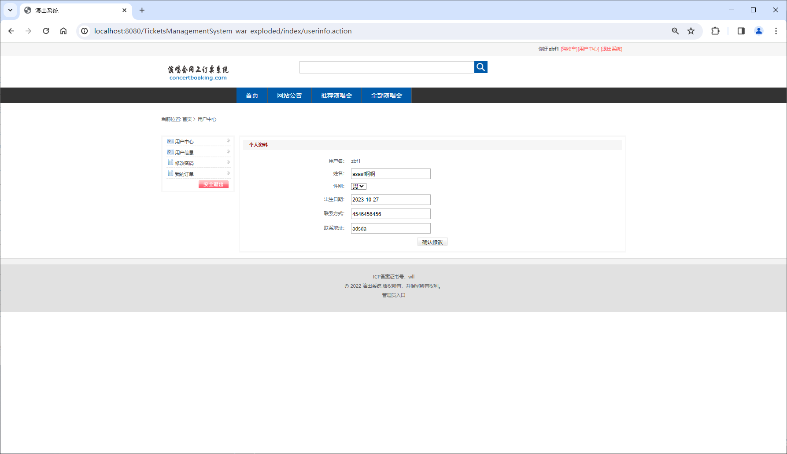
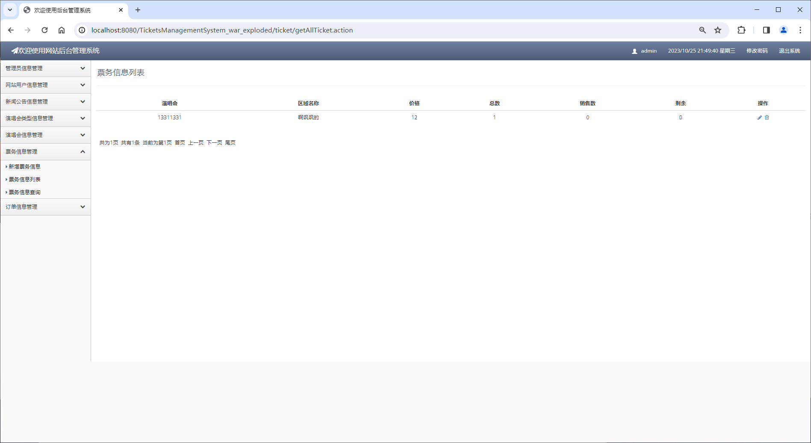

<h1 align="center">基于SSM框架的兴趣社区演出票务管理系统</h1>

 获取sql文件 QQ: 3645296857 QQ群: 978300347 

<h4> 需要视频演示可联系上述QQ，私发视频链接 </h4>

 获取更多高质量源码，请访问：[mzoo源码网](https://mzoocodes.com/)

## 简介

> 本代码来源于网络,仅供学习参考使用!
>
> <b style="color: dodgerblue"> 提供1.远程部署/2.修改代码/3.定制程序/4.文档指导/5.框架代码讲解、技术解答、代码讲解等服务 </b>
>
> 管理端地址：http://localhost:8080/admin/index.jsp
> 
> 管理员: admin 密码: 123456
>
> 用户端地址：http://localhost:8080/index/index.action
> 
> 用户：001 密码: 123456
>

## 项目介绍

基于SSM框架的兴趣社区演出票务管理系统：前端 JSP、BootStrap、JQuery、Ajax，后端 maven、springmvc、mybatis；角色分为管理员和用户。管理员发布新闻公告、添加演唱会类型、发布演唱会以及票务数量等；用户按演唱会类别买票、支付、添加购物车等。主要功能如下：

### 管理员：

- 基本操作：登录、修改密码
- 管理员管理：获取管理员信息列表、添加管理员信息、搜索管理员信息、修改管理员信息
- 用户管理：获取用户信息列表、搜索用户信息、删除用户
- 新闻公告管理：获取新闻公告列表、添加新闻公告、搜索新闻公告、修改新闻公告、删除新闻公告
- 演唱会类型管理：获取演唱会类型列表、添加演唱会类型、搜索演唱会类型、修改演唱会类型、删除演唱会类型
- 演唱会管理：获取演唱会信息列表、添加演唱会信息、搜索演唱会、修改演唱会信息、删除演唱会
- 票务管理：获取票务信息列表、添加票务信息、搜索票务、修改票务信息、删除票务
- 订单管理：获取订单信息列表、搜索订单、删除订单

### 用户：

- 基本操作：登录、注册、修改密码、获取个人信息、修改个人信息
- 演唱会模块：获取演唱会分类列表、筛选演唱会分类、获取演唱会列表、查看演唱会信息
- 网站公告模块：获取新闻公告列表、获取新闻公告信息
- 购物车模块：获取购物车列表、修改演唱会门票状态（移除、下单）
- 订单模块：获取订单列表、修改订单状态（付款、退票、转让）

## 环境

- <b>IntelliJ IDEA 2020.3</b>

- <b>Mysql 5.7.26</b>

- <b>Tomcat 9.0.41</b>

- <b>JDK 1.8</b>

## 运行截图

